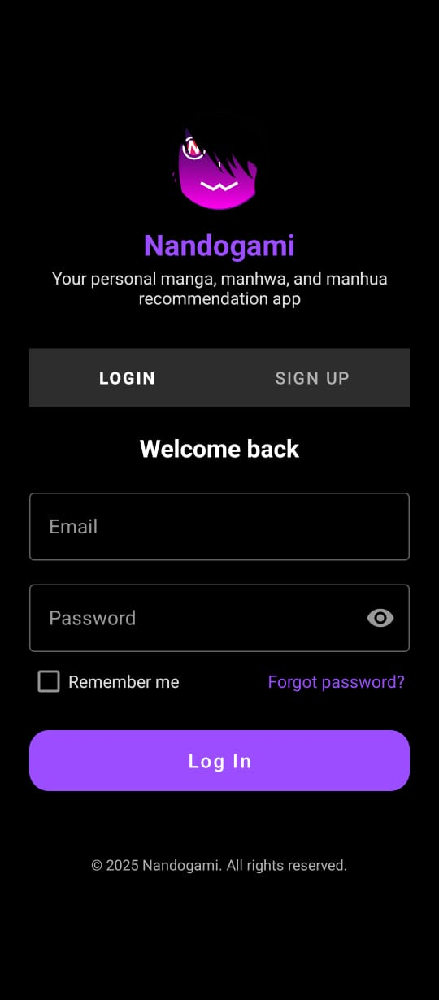
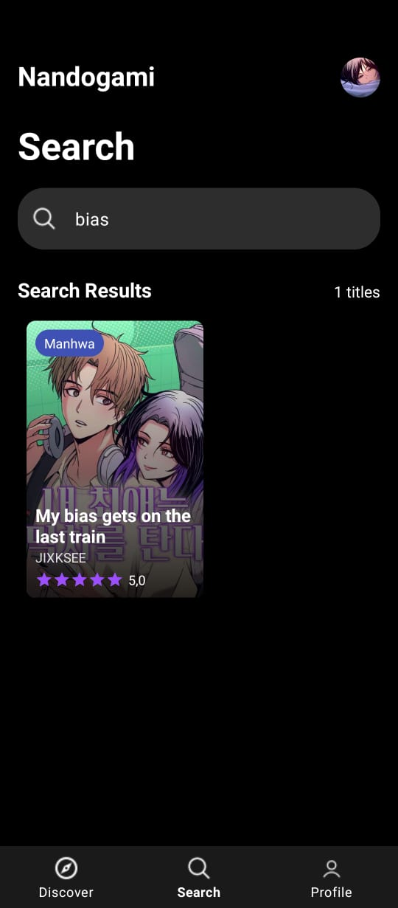
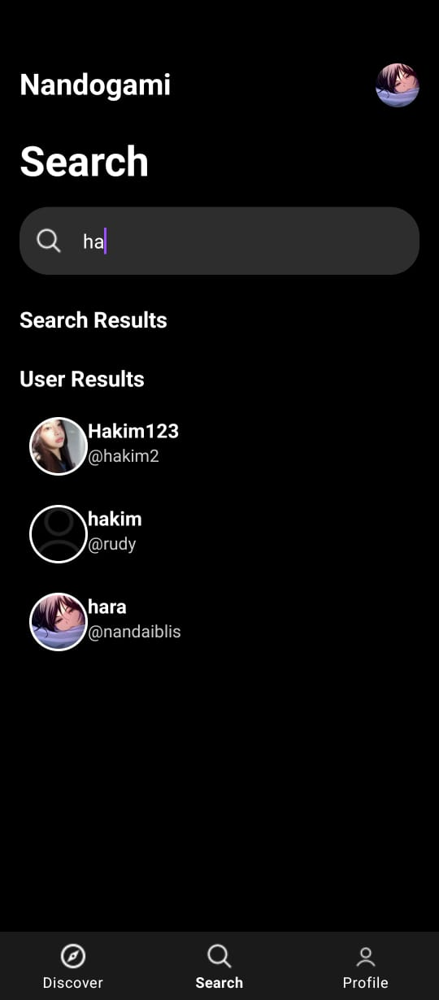
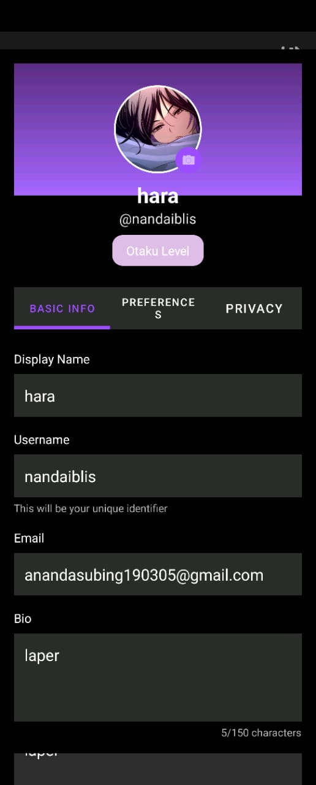
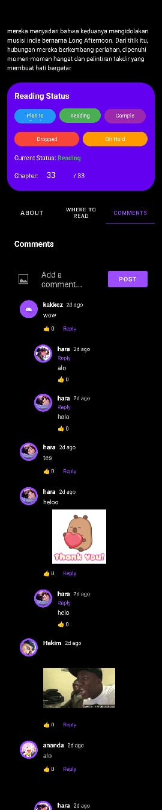

# Nandogami 📱✨
Aplikasi Rekomendasi Komik & Manga Modern untuk Android

---

## 📲 Download Aplikasi

Coba Nandogami versi terbaru:
[**Download Nandogami v1.0.0 (.apk)**](https://github.com/slabkim/Nandogami/releases/download/v1.0.0/Nandogami.apk)

---

## 🚀 Tentang Nandogami

**Nandogami** adalah aplikasi Android untuk para pecinta manga, manhwa, dan komik. Temukan, cari, dan dapatkan rekomendasi komik terbaik, terhubung dengan komunitas, dan kelola koleksi bacaanmu dengan mudah.

---

## 🎥 Demo & Screenshots
<div align="center">
  
  
  
  
  
  
  
  
</div>

---

## ✨ Fitur Terbaru & Unggulan

### 🔍 Pencarian Komik & User
- Cari komik berdasarkan judul, penulis, atau genre.
- **Cari user lain berdasarkan username** (unik, seperti Facebook).
- Hasil pencarian dibagi dua section: Komik & User.
- Klik user di hasil pencarian untuk melihat profil mereka.
- <b>Lihat pada screenshot: Search Comic, Search User</b>

### 🕵️‍♂️ Recent & Popular Search
- Riwayat pencarian (recent search) hanya update saat user benar-benar melakukan search.
- Popular search dengan chip interaktif.

### 👥 Sistem Sosial: Followers & Following
- Lihat dan klik jumlah followers/following di profil user lain.
- **Daftar followers/following** tampil di halaman khusus (UserListActivity).
- Klik user di daftar untuk melihat profil mereka.
- <b>Lihat pada screenshot: Other Profile</b>

### 💬 Komentar Komik & Pesan
- Komentar pada halaman detail komik.
- Fitur chat/message antar user.
- <b>Lihat pada screenshot: Comment Comic, List Message</b>

### 📚 Status Bacaan (Reading List)
- Lihat daftar komik yang sedang dibaca user lain (status "reading").
- Daftar komik tampil di halaman khusus (ReadingListActivity).
- Status bacaan lain: dropped, on hold, completed, dsb (bisa dikembangkan).

### 👤 Profil Modern & Edit Profile
- Profil user dengan avatar, bio, followers, following, reading count.
- Edit profil dengan UI modern dan preview avatar.
- **Logo aplikasi (logogede.png) tampil di halaman login & register** dalam lingkaran ungu.
- <b>Lihat pada screenshot: Edit Profile, Login, Other Profile</b>

### 🔒 Autentikasi Aman
- Login/register dengan Firebase Auth.
- Data user aman di cloud.

### 🎨 UI/UX Modern
- Dark mode, aksen ungu, layout responsif.
- Material Design 3, animasi transisi, efek ripple.
- Logo aplikasi custom di login/register.

---

## 🏆 Keunggulan Nandogami
- **Cepat & Ringan**: Optimasi untuk device low-end.
- **Realtime**: Data komik & user langsung dari Firebase Firestore.
- **Aman**: Autentikasi & data user terenkripsi.
- **Komunitas**: Fitur sosial, followers, dan pencarian user.
- **Open Source**: Siap dikembangkan komunitas.

---

## 🛠️ Teknologi
- **Kotlin** (100% Android Native)
- **MVVM Architecture**
- **Firebase Firestore & Auth**
- **Material Design 3**
- **Glide** (image loading)
- **Navigation Component**
- **LiveData & Coroutines**
- **Custom Animations & Ripple Effects**

---

## 📲 Cara Install & Build

1. **Clone repository**
   ```bash
   git clone https://github.com/slabkim/Nandogami.git
   cd Nandogami
   ```
2. **Setup Firebase**
   - Buat project di [Firebase Console](https://console.firebase.google.com/)
   - Download `google-services.json` ke folder `app/`
   - Enable Auth & Firestore
3. **Build & Run**
   - Jalankan `./gradlew build` atau klik "Run" di Android Studio

---

## 👥 Tim Pengembang
| Nama Lengkap                  | GitHub ID                |
|-------------------------------|--------------------------|
| Ananda Anhar Subing           | [@anndaanhr](https://github.com/anndaanhr) |
| Sulthon Abdul Hakim           | [@slabkim](https://github.com/slabkim)     |
| Muhammad Nur Faadil           | [@bugsm](https://github.com/bugsm)         |
| Wiranti Oktaviani Tanwin      | [@kanooooyon](https://github.com/Kanooooyon)|
| Kgs. Muhammad Fathurrahman    | [@Thorrr29](https://github.com/thorrr29)   |
| Faiz Ahmad Nadhif             | [@Antiether](https://github.com/Antiether) |

📧 **Email kontak:** anandasubing190305@gmail.com

---

## 🔗 Link Penting
- **Repository:** https://github.com/slabkim/Nandogami
- **Firebase Console:** https://console.firebase.google.com/

---

## 📄 Lisensi
MIT License. Lihat file [LICENSE](LICENSE) untuk detail.

---

## 🙏 Terima Kasih
- Material Design 3, Firebase, Glide, Android Jetpack
- Semua kontributor & pengguna Nandogami

---
<div align="center">
  <br>
  <b>Made with by Nandogami Team</b><br>
  <i>"Temukan komik favoritmu, kapan saja, di mana saja."</i>
</div>
