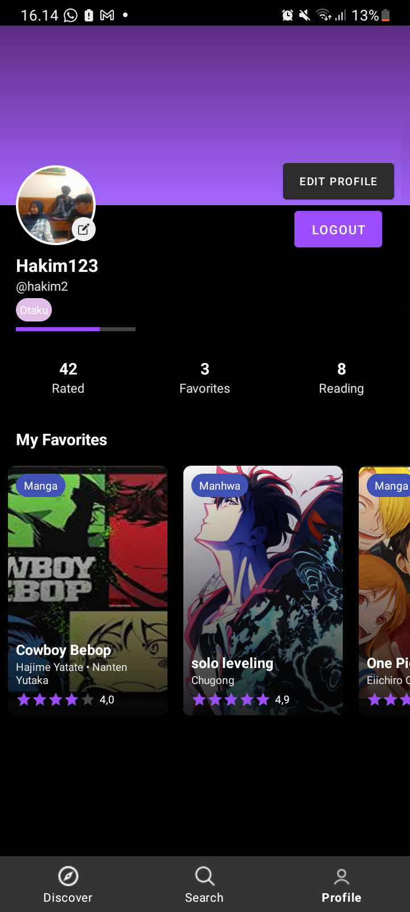

# Nandogami 📱✨  
Aplikasi Rekomendasi Komik & Manga Paling Keren untuk Android

---

## 🚀 Apa itu Nandogami?

**Nandogami** adalah aplikasi Android modern yang dirancang khusus untuk para pecinta manga dan komik. Dengan Nandogami, kamu bisa menemukan, mencari, dan mendapatkan rekomendasi komik terbaik dari berbagai genre, lengkap dengan fitur animasi, tampilan dark mode yang elegan, dan pengalaman pengguna yang interaktif. Temukan komik favoritmu, baca detailnya, dan dapatkan rekomendasi terbaru setiap saat!

---

## 🎥 Demo & Screenshots

<div align="center">
  
  
  
  
  
</div>

---

## ✨ Fitur Unggulan

### 🔥 Rekomendasi Komik Otomatis
- Dapatkan rekomendasi komik/manga populer setiap minggu.
- Fitur "Popular This Week", "Featured Titles", dan "New Releases".

### 🔍 Pencarian Super Canggih
- **Case-insensitive**: Cari judul tanpa peduli huruf besar/kecil.
- Pencarian di banyak field: judul, penulis, kategori.
- Riwayat pencarian & pencarian populer.
- Hasil pencarian langsung muncul dengan animasi transisi.

### 📚 Detail Komik Interaktif
- Info lengkap: judul, penulis, rating, sinopsis, genre, adaptasi.
- **Tab animasi**: About, Where to Read, Comments — dengan transisi halus.
- Komentar pengguna (mock) dengan tampilan modern.

### 🎨 UI/UX Modern & Animasi
- **Dark mode** elegan, aksen ungu, dan layout responsif.
- Animasi transisi antar tab & halaman.
- Material Design 3, smooth navigation, dan efek ripple di setiap klik.
- Komponen interaktif dengan feedback visual.

### 👤 Profil & Autentikasi
- Login/register dengan Firebase Auth.
- Edit profil, avatar, dan logout.
- Data pengguna aman di cloud.

### 🌐 Platform Baca Resmi
- Tab "Where to Read" menampilkan link ke Manga Plus, VIZ Media, Crunchyroll.
- Kotak platform dengan desain modern, warna kontras, dan animasi klik.

---

## 🏆 Keunggulan Nandogami

- **Cepat & Ringan**: Optimasi performa untuk device low-end sekalipun.
- **Realtime**: Data komik langsung dari Firebase Firestore.
- **Aman**: Autentikasi dan data user terenkripsi.
- **User Experience**: Navigasi mudah, transisi animasi, dan feedback visual di setiap aksi.
- **Open Source**: Siap dikembangkan lebih lanjut oleh komunitas.

---

## 🛠️ Teknologi yang Digunakan

- **Kotlin** (100% Android Native)
- **MVVM Architecture**
- **Firebase Firestore & Auth**
- **Material Design 3**
- **Glide** (image loading)
- **Navigation Component**
- **LiveData & Coroutines**
- **Custom Animations & Ripple Effects**

---

## 📲 Cara Install & Build

1. **Clone repository**
   ```bash
   git clone https://github.com/slabkim/Nandogami.git
   cd Nandogami
   ```
2. **Setup Firebase**
   - Buat project di [Firebase Console](https://console.firebase.google.com/)
   - Download `google-services.json` ke folder `app/`
   - Enable Auth & Firestore
3. **Build & Run**
   - Jalankan `./gradlew build` atau klik "Run" di Android Studio

---

## 👥 Tim Pengembang

| Nama Lengkap                  | GitHub ID                |
|-------------------------------|--------------------------|
| Ananda Anhar Subing           | [@anndaanhr](https://github.com/anndaanhr) |
| Sulthon Abdul Hakim           | [@slabkim](https://github.com/slabkim)     |
| Muhammad Nur Faadil           | [@bugsm](https://github.com/bugsm)         |
| Wiranti Oktaviani Tanwin      | [@kanooooyon](https://github.com/Kanooooyon)|
| Kgs. Muhammad Fathurrahman    | [@Thorrr29](https://github.com/thorrr29)   |
| Faiz Ahmad Nadhif             | [@Antiether](https://github.com/Antiether) |

📧 **Email kontak:** anandasubing190305@gmail.com

---

## 🔗 Link Penting

- **Repository:** https://github.com/slabkim/Nandogami
- **Firebase Console:** https://console.firebase.google.com/

---

## 📄 Lisensi

MIT License. Lihat file [LICENSE](LICENSE) untuk detail.

---

## 🙏 Terima Kasih

- Material Design 3, Firebase, Glide, Android Jetpack
- Semua kontributor & pengguna Nandogami

---

<div align="center">
  <b>Made with ❤️ by Nandogami Team</b><br>
  <i>"Temukan komik favoritmu, kapan saja, di mana saja."</i>
</div>
